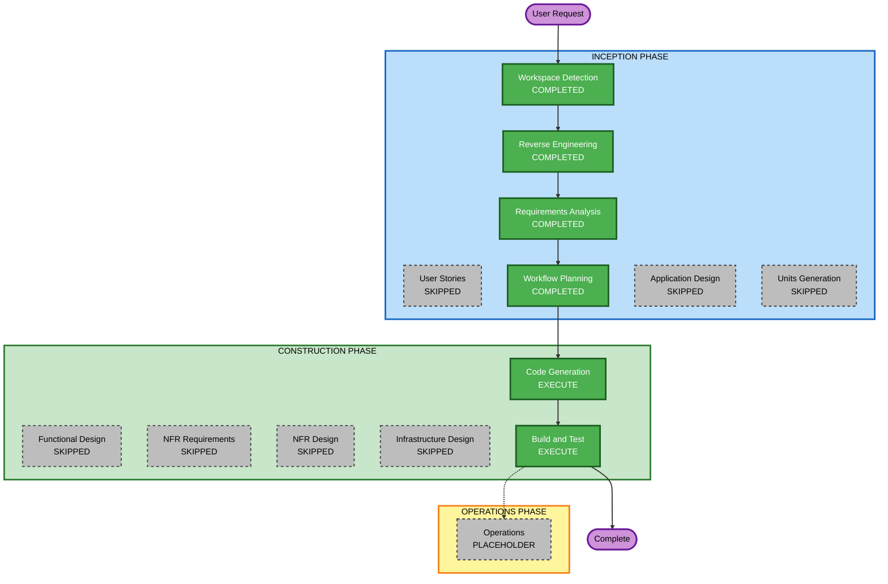

# Execution Plan

## Detailed Analysis Summary

### Transformation Scope (Brownfield)
- **Transformation Type**: Single component change (tooling hygiene + test coverage), no architectural transformation
- **Primary Changes**:
  1. Remove `package-lock.json`, standardize on `pnpm-lock.yaml`
  2. Rename `lib/queries/` → `lib/hooks/`, update all import sites
  3. Add Vitest + fast-check unit tests for `lib/auth.ts` and validation/serialization logic in `lib/branding.ts`, `lib/documents.ts`, `lib/tenant-users.ts`, `lib/analytics.ts`
- **Related Components**: `app/console/**` (import sites consuming `lib/queries/*`), `package.json` (new devDependencies: `vitest`, `fast-check`, plus a `test` script)

### Change Impact Assessment
- **User-facing changes**: No — zero behavioral change to the running application
- **Structural changes**: Minor — one directory rename, no architectural change
- **Data model changes**: No — `prisma/schema.prisma` untouched
- **API changes**: No — no route handler signatures or contracts change
- **NFR impact**: Yes — introduces a test framework and formalizes Security Baseline / PBT extension compliance for the affected modules (both extensions enabled at Requirements Analysis)

### Component Relationships (Brownfield)
- **Primary Component**: `lib/queries/**` (rename target), `lib/auth.ts`, `lib/branding.ts`, `lib/documents.ts`, `lib/tenant-users.ts`, `lib/analytics.ts` (test targets)
- **Infrastructure Components**: None (no CDK/Terraform in this repo)
- **Shared Components**: `package.json`/lockfiles (build tooling)
- **Dependent Components**: `app/console/users/**`, `app/console/branding/page.tsx`, `app/console/documents/page.tsx`, `app/console/analytics/page.tsx` — all import from `lib/queries/*`, must be updated to `lib/hooks/*`
- **Supporting Components**: None (no monitoring/deployment changes)

### Risk Assessment
- **Risk Level**: Low — isolated, mechanical changes with no behavior change; easily reverted via git
- **Rollback Complexity**: Easy — revert the commit(s)
- **Testing Complexity**: Simple — new unit tests are additive; existing `pnpm run build`/`pnpm run lint` validate the rename didn't break imports

## Workflow Visualization



### Text Alternative
```
Workspace Detection (COMPLETED) -> Reverse Engineering (COMPLETED) -> Requirements Analysis (COMPLETED)
  -> Workflow Planning (COMPLETED) -> Code Generation (EXECUTE) -> Build and Test (EXECUTE) -> Complete
Skipped: User Stories, Application Design, Units Generation, Functional Design, NFR Requirements, NFR Design, Infrastructure Design
Operations phase remains a placeholder (dashed link, not executed).
```

## Phases to Execute

### INCEPTION PHASE
- [x] Workspace Detection (COMPLETED)
- [x] Reverse Engineering (COMPLETED)
- [x] Requirements Analysis (COMPLETED)
- [x] User Stories (SKIPPED) — pure technical debt/refactoring task, zero new user-facing functionality
- [x] Execution Plan (this document)
- [ ] Application Design — **SKIP**
  - **Rationale**: No new components or services; all three changes (lockfile, rename, tests) happen within existing component boundaries
- [ ] Units Generation — **SKIP**
  - **Rationale**: This is a single cohesive unit of work (tooling + rename + tests); no benefit from decomposing into multiple units

### CONSTRUCTION PHASE (single unit: "tech-debt-cleanup")
- [ ] Functional Design — **SKIP**
  - **Rationale**: No new data models or business logic is introduced. PBT-01 (property identification) will instead be performed as part of Code Generation Planning, since the properties being tested belong to existing, already-designed logic rather than a new design under construction
- [ ] NFR Requirements — **SKIP**
  - **Rationale**: Tech stack for this unit (Vitest test runner, fast-check PBT framework) was already decided during Requirements Analysis via direct user dialogue; no further tech stack selection needed
- [ ] NFR Design — **SKIP**
  - **Rationale**: NFR Requirements was skipped; no NFR patterns to incorporate beyond what's already specified in requirements.md
- [ ] Infrastructure Design — **SKIP**
  - **Rationale**: No infrastructure changes (no CDK/Terraform/cloud resources in this repository)
- [ ] Code Generation — **EXECUTE (ALWAYS)**
  - **Rationale**: Implementation of the lockfile fix, directory rename + import updates, and new test files. Must include PBT-01 property identification and a Security Baseline / PBT compliance summary per the enabled extensions before presenting completion
- [ ] Build and Test — **EXECUTE (ALWAYS)**
  - **Rationale**: Verify `pnpm install`, `pnpm run build`, `pnpm run lint`, and the new `pnpm run test` (Vitest) all pass after the changes

### OPERATIONS PHASE
- [ ] Operations — PLACEHOLDER (not applicable — no deployment/monitoring changes)

## Package Change Sequence
Single package (this is a monolithic Next.js app, not a multi-package repo). Recommended order within the one Code Generation pass:
1. Lockfile cleanup (remove `package-lock.json`) — independent, no code impact
2. Add `vitest` + `fast-check` as devDependencies, add `test` script to `package.json`
3. Rename `lib/queries/` → `lib/hooks/` and update all import sites (must precede/accompany writing new tests that import from the renamed path)
4. Write unit + property-based tests for `lib/auth.ts`, `lib/branding.ts`, `lib/documents.ts`, `lib/tenant-users.ts`, `lib/analytics.ts`

## Estimated Timeline
- **Total Phases Executing**: 2 (Code Generation, Build and Test) out of 13 possible stages — all other applicable stages already completed (Workspace Detection, Reverse Engineering, Requirements Analysis) or skipped as not applicable
- **Estimated Duration**: Single work session (small, mechanical scope)

## Success Criteria
- **Primary Goal**: Eliminate the three flagged technical-debt items without changing application behavior
- **Key Deliverables**:
  - Exactly one committed lockfile (`pnpm-lock.yaml`)
  - `lib/hooks/` replacing `lib/queries/`, all imports updated, `pnpm run build` succeeds
  - Unit + property-based test suite (Vitest + fast-check) covering `lib/auth.ts` and validation/serialization logic in the four domain libraries listed above, runnable via `pnpm run test`
- **Quality Gates**:
  - `pnpm run build` passes
  - `pnpm run lint` passes
  - `pnpm run test` passes
  - Security Baseline compliance summary shows no unresolved blocking findings for the applicable rules (SECURITY-10, SECURITY-12, SECURITY-03)
  - PBT compliance summary shows no unresolved blocking findings for the applicable rules (PBT-01, 02, 03, 07, 08, 09, 10)
