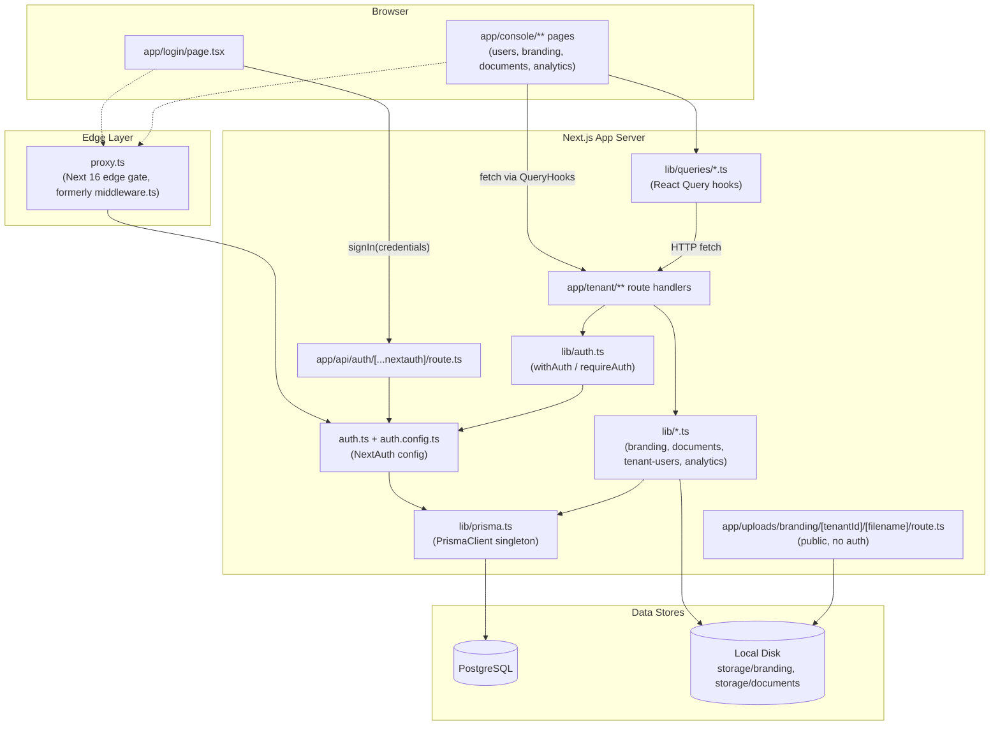
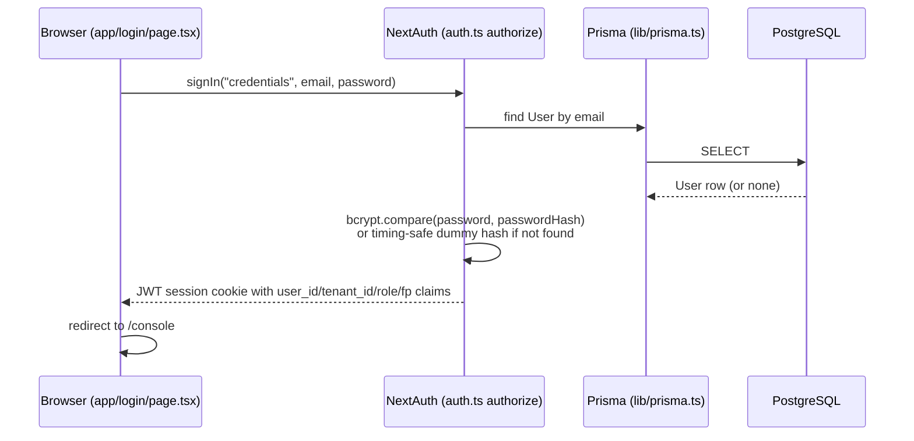
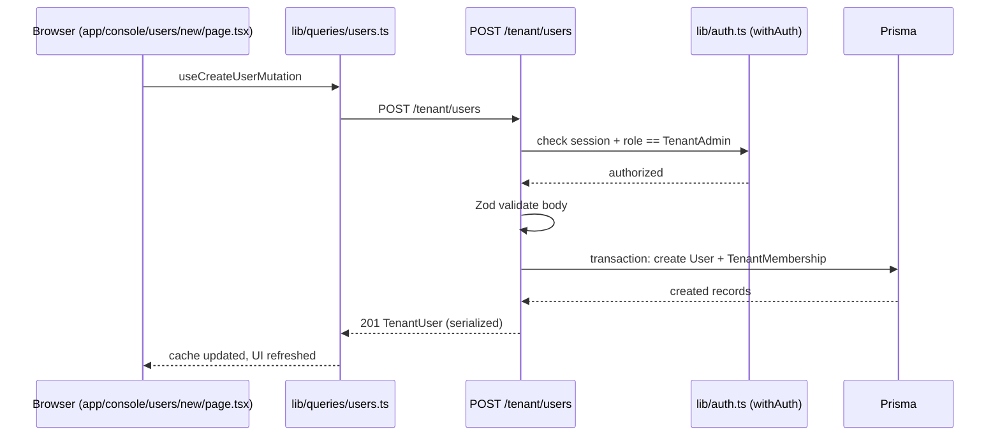
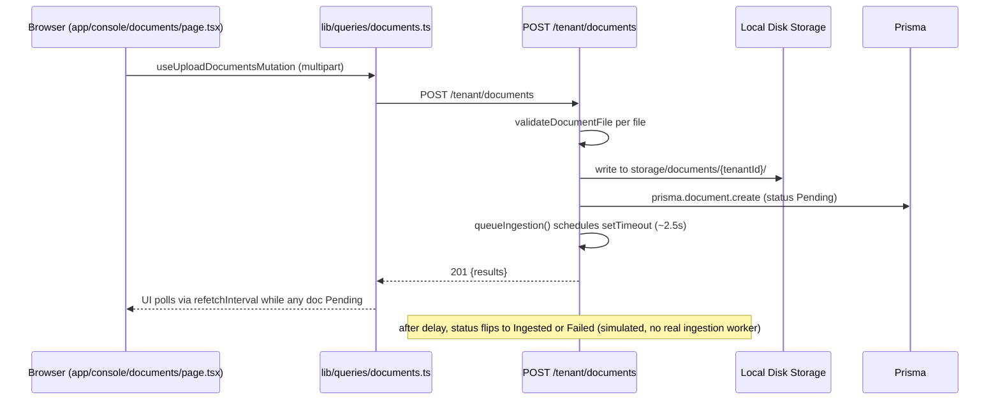

# System Architecture

## System Overview

A single Next.js 16 (App Router) monolith — there are no separate microservices or packages. The application serves both the admin UI (`app/console/**`) and its backing JSON API (`app/tenant/**`) from one deployable. Data is persisted in PostgreSQL via Prisma 7 (driver-adapter model, `@prisma/adapter-pg`). Authentication uses NextAuth v5 (beta) with a Credentials provider and JWT session cookies. File uploads (branding logos, documents) are stored on local disk outside `public/`.

## Architecture Diagram



### Text Alternative
```
Browser (login page, console pages)
  -> proxy.ts (edge auth gate: redirects unauthenticated /console, 401s unauthenticated /tenant)
  -> Next.js App Server
       - app/api/auth/[...nextauth] -> auth.ts/auth.config.ts (NextAuth) -> lib/prisma.ts -> PostgreSQL
       - app/tenant/** route handlers -> lib/auth.ts (withAuth) -> auth core
                                       -> lib/*.ts domain logic -> lib/prisma.ts -> PostgreSQL
                                                                 -> local disk storage
       - app/uploads/branding/[tenantId]/[filename] (public) -> local disk storage
Console pages also call lib/queries/*.ts (React Query hooks) which fetch the /tenant/** API.
```

## Component Descriptions

### Console UI Pages (`app/console/**`)
- **Purpose**: Render the admin experience for tenant users.
- **Responsibilities**: Forms/tables for users, branding, documents, analytics; role-aware sidebar; toast notifications.
- **Dependencies**: `lib/queries/*.ts`, `components/ui/**`, `components/charts/**`, `store/**` (Redux UI state).
- **Type**: Application (UI).

### Tenant API Route Handlers (`app/tenant/**`)
- **Purpose**: Backend JSON API consumed by the Console UI.
- **Responsibilities**: Validate requests (Zod), enforce auth/role via `withAuth`, execute Prisma queries, serialize responses to snake_case wire format.
- **Dependencies**: `lib/auth.ts`, `lib/*.ts` domain modules, `lib/prisma.ts`.
- **Type**: Application (API).

### Authentication Core (`auth.ts`, `auth.config.ts`, `proxy.ts`, `lib/auth.ts`)
- **Purpose**: Establish and validate the tenant user's identity and role on every request.
- **Responsibilities**:
  - `auth.config.ts` — edge-safe NextAuth config (no Prisma/bcrypt), used by `proxy.ts`.
  - `auth.ts` — full NextAuth config with Credentials `authorize()` (bcrypt compare, timing-safe dummy hash for unknown emails), extends `auth.config.ts`.
  - `proxy.ts` — Next 16's renamed `middleware.ts`; edge gate that redirects unauthenticated `/console/**` to `/login`, 401s unauthenticated `/tenant/**`, and redirects authenticated users away from `/login`.
  - `lib/auth.ts` — per-route `withAuth`/`requireAuth` wrapper used by every `/tenant/**` handler; also implements `computeMembershipFingerprint`, rechecked against the DB every 60s via the JWT callback so password changes/deactivation invalidate sessions without a server-side revocation list.
- **Dependencies**: `lib/prisma.ts`, `bcryptjs`, `jose` (via next-auth).
- **Type**: Application (cross-cutting).

### Data Access (`lib/prisma.ts`, `prisma/schema.prisma`)
- **Purpose**: Single PrismaClient instance (cached on `globalThis` for dev HMR) backed by PostgreSQL via `@prisma/adapter-pg`.
- **Type**: Infrastructure.

### Domain Libraries (`lib/branding.ts`, `lib/documents.ts`, `lib/tenant-users.ts`, `lib/analytics.ts` + their `-client.ts` counterparts)
- **Purpose**: Server-side validation/serialization logic per domain, paired with hand-mirrored client-side TypeScript types (`-client.ts`) so Prisma types never leak into the client bundle.
- **Type**: Shared/Application.

### Client Data Hooks (`lib/queries/*.ts`)
- **Purpose**: TanStack React Query hooks that fetch/mutate the `/tenant/**` API from Console pages.
- **Type**: Shared (client).

### State Management (`store/**`)
- **Purpose**: Redux Toolkit store for UI-only state (sidebar open/closed, toast queue, analytics date-range selection). No server data lives in Redux — that is React Query's responsibility.
- **Type**: Shared (client).

## Data Flow

### Login


### Tenant User Creation


### Document Upload


## Integration Points

- **External APIs**: None. No third-party API calls are made by this codebase.
- **Databases**: PostgreSQL, accessed exclusively through Prisma (`@prisma/adapter-pg`).
- **Third-party Services**: None. Analytics and document ingestion are simulated in-process (see Code Quality Assessment).

## Infrastructure Components

- **CDK Stacks**: None — no infrastructure-as-code found in this repository.
- **Deployment Model**: Single Next.js server process (`next start`); no containerization or IaC present in the repo.
- **Networking**: Not defined in this repository (no VPC/subnet/security-group configuration present).
