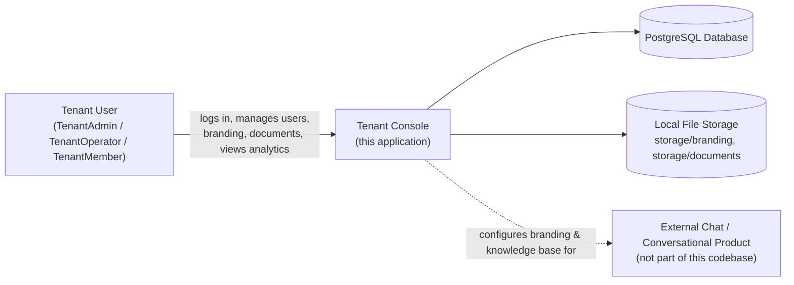

# Business Overview

## Business Context Diagram



### Text Alternative
```
Tenant User --uses--> Tenant Console --reads/writes--> PostgreSQL Database
Tenant Console --reads/writes--> Local File Storage (branding logos, documents)
Tenant Console --configures branding & knowledge base for--> External Chat/Conversational Product (out of scope, not in this codebase)
```

## Business Description

- **Business Description**: The system is a multi-tenant SaaS admin console ("Tenant Console") that lets each tenant self-manage its own configuration and view usage reporting for a larger conversational/chat product. The chat product itself is external and not part of this codebase — this application only provides the tenant-facing configuration and analytics surface for it (per `task.md`, which describes a "knowledge base" and "that tenant's experience" fed by this console).
- **Business Transactions**:
  1. **Authentication** — a tenant user logs in with email/password; the system resolves tenant membership and role.
  2. **Tenant user management** (TenantAdmin only) — list, create, view, edit, change password, deactivate/reactivate other users within the same tenant.
  3. **Branding customization** — upload/replace a logo and choose primary/secondary/accent colors, used across "that tenant's experience."
  4. **Document / knowledge-base management** — upload documents that are queued and asynchronously "ingested" into the tenant's knowledge base, with status tracking (Pending / Ingested / Failed).
  5. **Analytics dashboard** — per-tenant, date-range-filterable conversational analytics (visitors, conversations, questions, funnel, topic breakdown, voice/text split, day/hour heatmaps, billing-period answer counts), exportable as CSV/JSON.
- **Business Dictionary**:
  - **Tenant** — an organization/customer using the product.
  - **User** — a global identity holding membership in exactly one tenant today (`User` Prisma model).
  - **TenantMembership** — join of User + Tenant carrying `role` (TenantAdmin / TenantOperator / TenantMember) and `status` (Active / Disabled).
  - **TenantBranding** — one-to-one with Tenant: logo + 3 brand colors.
  - **Document** — a tenant-scoped uploaded file with ingestion `status` (Pending / Ingested / Failed).
  - **TenantAdmin** — role with full control including user management.
  - **TenantOperator / TenantMember** — non-admin roles, scoped to their own tenant's operational features.

## Component Level Business Descriptions

### Console UI (`app/console/**`)
- **Purpose**: Human-facing admin UI where tenant users perform all business transactions.
- **Responsibilities**: Role-aware navigation, forms and tables for users/branding/documents/analytics, session-driven access control.

### Tenant API (`app/tenant/**`)
- **Purpose**: JSON API surface consumed by the Console UI; enforces business rules and tenant scoping.
- **Responsibilities**: Validate input, enforce role-based authorization, orchestrate persistence and (simulated) downstream processing (document ingestion).

### Authentication (`auth.ts`, `auth.config.ts`, `proxy.ts`, `lib/auth.ts`)
- **Purpose**: Identify the tenant user and their role/membership status on every request.
- **Responsibilities**: Credential verification, session issuance, per-route role gating, session invalidation on password change/deactivation.

### Data Layer (`prisma/schema.prisma`, `lib/prisma.ts`)
- **Purpose**: System of record for tenants, users, memberships, branding, and documents.
- **Responsibilities**: Persistence and referential integrity (cascade deletes scoped to tenant).
