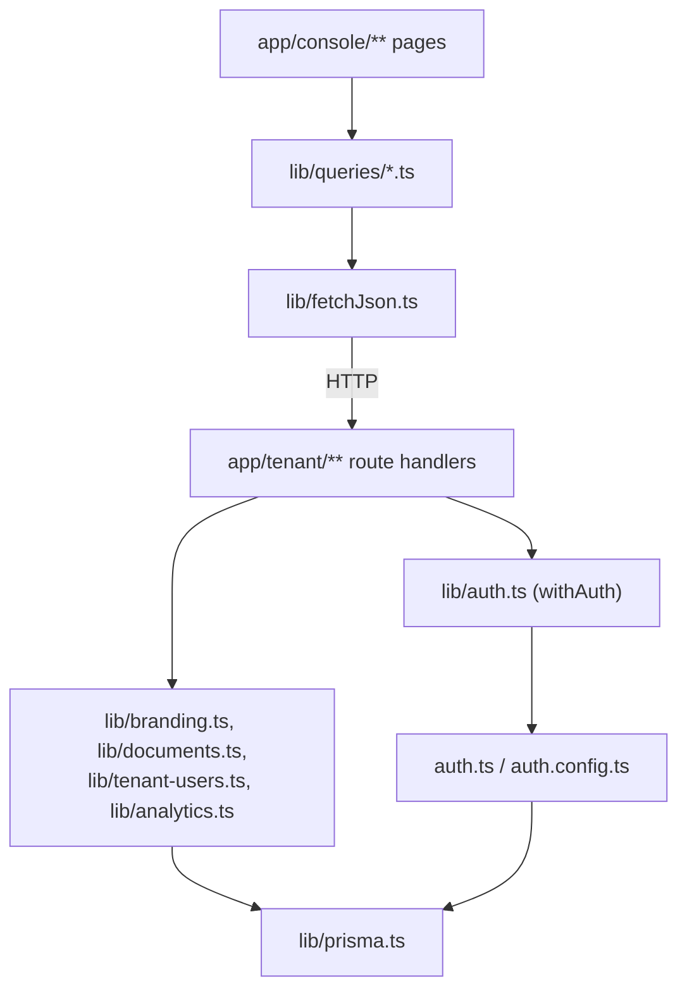

# Code Structure

## Build System

- **Type**: npm (Next.js build pipeline). Note: both `package-lock.json` and `pnpm-lock.yaml` are committed — see Code Quality Assessment for the resulting inconsistency risk.
- **Configuration**: `package.json` (scripts: `dev`, `build`, `start`, `lint`), `next.config.ts`, `tsconfig.json` (strict mode, ES2017 target, bundler module resolution), `eslint.config.mjs` (flat config, `eslint-config-next` core-web-vitals + typescript), `postcss.config.mjs` (Tailwind v4), `prisma.config.ts`.

## Key Classes/Modules



### Text Alternative
```
Console pages -> lib/queries/*.ts (React Query hooks) -> lib/fetchJson.ts -> HTTP -> app/tenant/** routes
app/tenant/** routes -> lib/auth.ts (withAuth) -> auth.ts/auth.config.ts -> lib/prisma.ts
app/tenant/** routes -> domain libs (lib/branding.ts, lib/documents.ts, lib/tenant-users.ts, lib/analytics.ts) -> lib/prisma.ts
```

### Existing Files Inventory

**`app/`**
- `layout.tsx` — root HTML layout; loads Geist fonts, wraps app in `Providers`
- `page.tsx` — root route; redirects to `/console`
- `providers.tsx` — client component wiring `SessionProvider` + Redux `Provider` + `QueryClientProvider`
- `globals.css` — Tailwind v4 global styles + CSS custom properties for chart colors
- `login/page.tsx` — login form; calls `signIn("credentials", ...)`
- `hooks/input-value.ts` — `useInputValue` controlled-input hook, used by the login form
- `api/auth/[...nextauth]/route.ts` — NextAuth handler passthrough
- `console/layout.tsx` — authenticated shell: role-aware sidebar nav, mobile menu, logout, `ToastHost`
- `console/page.tsx` — overview/welcome page (server component, reads `auth()` directly)
- `console/users/layout.tsx` — gates children to TenantAdmin only (server component)
- `console/users/page.tsx` — user directory table
- `console/users/new/page.tsx` — create-user form
- `console/users/[user_id]/page.tsx` — user detail: edit profile, change password, deactivate/reactivate
- `console/branding/page.tsx` — logo upload + color pickers with live preview
- `console/documents/page.tsx` — document upload + status table (polls while Pending)
- `console/analytics/page.tsx` — analytics dashboard: date-range presets, charts, CSV/JSON export
- `tenant/users/route.ts` — GET (list) / POST (create), TenantAdmin only
- `tenant/users/[user_id]/route.ts` — GET / PATCH, TenantAdmin only
- `tenant/users/[user_id]/change-password/route.ts` — POST, TenantAdmin only
- `tenant/users/[user_id]/deactivate/route.ts` — POST, TenantAdmin only
- `tenant/users/[user_id]/reactivate/route.ts` — POST, TenantAdmin only
- `tenant/branding/route.ts` — GET / PATCH (colors), any authenticated tenant user
- `tenant/branding/logo/route.ts` — POST (multipart upload), any authenticated tenant user
- `tenant/documents/route.ts` — GET (list) / POST (multipart upload), any authenticated tenant user
- `tenant/analytics/route.ts` — GET (JSON), any authenticated tenant user
- `tenant/analytics/export/route.ts` — GET (CSV/JSON file download), any authenticated tenant user
- `uploads/branding/[tenantId]/[filename]/route.ts` — GET, public, serves logo files from disk

**`components/ui/`**: `Alert`, `Badge`, `Button` (also exports `buttonClasses`), `Card`, `Checkbox`, `ColorSwatchField`, `DataTable`, `FileField`, `Muted`, `SelectField`, `TextField` — generic form/display primitives

**`components/charts/`**: `HBarChart`, `HeatmapRow`, `LineChart` (custom SVG line chart, no charting library dependency), `SplitBar`, `StatTile`, `TableToggle` (toggles a chart between graphical and tabular view) — analytics-specific visualization primitives

**`components/ToastHost.tsx`** — renders the Redux toast queue

**`lib/`**
- `auth.ts` — `requireAuth`/`withAuth`/`AuthError`, per-route auth+role gate
- `prisma.ts` — singleton `PrismaClient` w/ pg adapter, `globalThis` caching for dev HMR
- `fetchJson.ts` — client-side fetch wrapper (JSON content-type unless `FormData`, throws on non-2xx)
- `contrast-color.ts` — WCAG relative-luminance calculation to pick black/white text over an arbitrary background color
- `branding.ts` / `branding-client.ts` — server validation+serialization / client-shared types for branding
- `documents.ts` / `documents-client.ts` — server validation+serialization+fake-ingestion / client-shared types for documents
- `tenant-users.ts` / `tenant-users-client.ts` — server serialization+lookup helpers / client-shared types for tenant users
- `analytics.ts` / `analytics-client.ts` — deterministic seeded-random analytics generator + CSV export / client-shared response type
- `queries/*.ts` — React Query hooks per domain (users, branding, documents, analytics) — the client-side data-fetching layer consumed by pages

**`store/`**: `index.ts` (Redux store, single `ui` reducer), `uiSlice.ts` (sidebar/analyticsRange/toasts), `hooks.ts` (typed dispatch/selector hooks)

**`prisma/`**: `schema.prisma` (5 models, 3 enums), `seed.ts` (creates demo tenant "acme" + TenantAdmin `admin@acme.test`), `migrations/20260811072652_init/`

**`types/next-auth.d.ts`** — module augmentation adding `user_id/tenant_id/role/display_name` to NextAuth's `Session.user` and `tenant_id/role/fp` to `User`

**Root-level**: `auth.ts`, `auth.config.ts`, `proxy.ts` (Next 16's renamed `middleware.ts`), `prisma.config.ts`

## Design Patterns

### Higher-Order Route Wrapper
- **Location**: every `/tenant/**` route handler, via `lib/auth.ts`
- **Purpose**: Centralize the auth+role check into one line per route (`withAuth(handler, {roles?})`) instead of repeated try/catch blocks.
- **Implementation**: `withAuth` wraps a handler, resolves the session, throws/returns 401/403 (`AuthError`) before invoking the wrapped handler.

### Server/Client Type-Mirroring
- **Location**: each domain module pair, e.g. `lib/branding.ts` + `lib/branding-client.ts`
- **Purpose**: Keep Prisma-derived types out of the client bundle.
- **Implementation**: Server files use Prisma types and do DB/validation work; client files hand-declare matching plain TypeScript interfaces consumed by `lib/queries/*.ts` and pages.

### Deterministic Pseudo-Random Generation
- **Location**: `lib/analytics.ts`
- **Purpose**: Produce stable "fake" analytics data (no real analytics backend exists yet) that doesn't change between requests for the same tenant/date.
- **Implementation**: `mulberry32` PRNG seeded via an FNV-1a hash of `tenant_id + date`.

### Render-Time Form Sync (no `useEffect`)
- **Location**: `app/console/branding/page.tsx`, `app/console/users/[user_id]/page.tsx`
- **Purpose**: Sync form-local state from query data without an extra render.
- **Implementation**: Compares current query data against a "synced with" ref value during render and updates local state inline if it changed, explicitly commented in the source as an intentional optimization.

### Security-by-Construction Validation
- **Location**: `lib/branding.ts` (SVG excluded from allowed logo MIME types — stored-XSS vector), `app/uploads/branding/[tenantId]/[filename]/route.ts` (path-traversal `..` rejection), `auth.ts` (timing-safe dummy-hash comparison for unknown emails)
- **Purpose**: Prevent common web vulnerabilities by construction rather than by after-the-fact filtering.

## Critical Dependencies

### next-auth (5.0.0-beta.32)
- **Usage**: Credentials provider, JWT session strategy, 7-day cookie lifetime; extended with custom claims (`user_id`, `tenant_id`, `role`, `fp`) via `types/next-auth.d.ts` module augmentation.
- **Purpose**: Authentication and session management.

### @prisma/client / @prisma/adapter-pg / prisma (7.9.1) + pg (8.23.0)
- **Usage**: Driver-adapter model (not the legacy binary/library engine); single client instance cached on `globalThis`.
- **Purpose**: ORM access to PostgreSQL.

### @reduxjs/toolkit / react-redux
- **Usage**: One slice (`uiSlice`) for sidebar open/closed, toast queue, analytics date-range selection — UI-only state, no server data.
- **Purpose**: Client-side UI state management.

### @tanstack/react-query (5.101.4)
- **Usage**: All server-data fetching/mutation/caching via `lib/queries/*.ts` hooks; polling (`refetchInterval`) for document ingestion status.
- **Purpose**: Server-state management.

### zod (4.4.3)
- **Usage**: Request body/query validation in every mutating `/tenant/**` route handler.
- **Purpose**: Input validation.

### bcryptjs (3.0.3)
- **Usage**: Password hashing (cost factor 10) and comparison in `auth.ts`.
- **Purpose**: Credential security.
