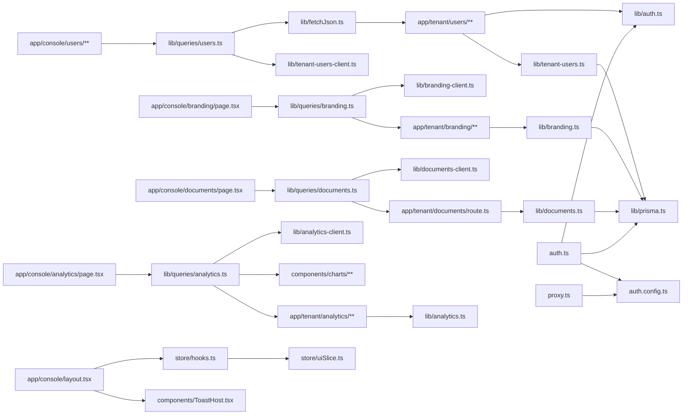

# Dependencies

## Internal Dependencies



### Text Alternative
```
app/console/users/** -> lib/queries/users.ts -> lib/fetchJson.ts + lib/tenant-users-client.ts
  -> app/tenant/users/** -> lib/auth.ts + lib/tenant-users.ts -> lib/prisma.ts

app/console/branding/page.tsx -> lib/queries/branding.ts -> lib/branding-client.ts
  -> app/tenant/branding/** -> lib/branding.ts -> lib/prisma.ts

app/console/documents/page.tsx -> lib/queries/documents.ts -> lib/documents-client.ts
  -> app/tenant/documents/route.ts -> lib/documents.ts -> lib/prisma.ts

app/console/analytics/page.tsx -> lib/queries/analytics.ts -> lib/analytics-client.ts + components/charts/**
  -> app/tenant/analytics/** -> lib/analytics.ts

app/console/layout.tsx -> store/hooks.ts -> store/uiSlice.ts
app/console/layout.tsx -> components/ToastHost.tsx

auth.ts -> auth.config.ts + lib/auth.ts + lib/prisma.ts
proxy.ts -> auth.config.ts only (edge-safe, no Prisma/bcrypt)

Nearly every components/ui/* primitive is consumed across all app/console/** pages.
```

### Notable Internal Dependency Relationships
- **`app/console/users/**` depends on `lib/queries/users.ts`**
  - **Type**: Compile/Runtime
  - **Reason**: Console pages never call `fetch` directly; all server-data access goes through React Query hooks for caching/mutation handling.
- **`app/tenant/**` route handlers depend on `lib/auth.ts`**
  - **Type**: Runtime
  - **Reason**: Centralized `withAuth` wrapper enforces session and role checks consistently across all API routes.
- **`proxy.ts` depends only on `auth.config.ts` (not `auth.ts`)**
  - **Type**: Runtime
  - **Reason**: `proxy.ts` runs at the edge, which cannot use Prisma or bcrypt (Node-only APIs); `auth.config.ts` is deliberately kept edge-safe for this reason.
- **Domain client files (`lib/*-client.ts`) have no dependency on `lib/prisma.ts`**
  - **Type**: Compile
  - **Reason**: Intentional separation so Prisma types/client code are never bundled for the browser.

## External Dependencies

### next (16.3.0)
- **Purpose**: Application framework (App Router, route handlers, edge proxy)
- **License**: MIT

### react / react-dom (19.2.8)
- **Purpose**: UI rendering
- **License**: MIT

### next-auth (5.0.0-beta.32)
- **Purpose**: Authentication (Credentials provider, JWT sessions)
- **License**: ISC

### @prisma/client / @prisma/adapter-pg / prisma (7.9.1)
- **Purpose**: ORM and PostgreSQL driver adapter
- **License**: Apache-2.0

### pg (8.23.0)
- **Purpose**: PostgreSQL driver used by the Prisma adapter
- **License**: MIT

### bcryptjs (3.0.3)
- **Purpose**: Password hashing/verification
- **License**: MIT

### jose (6.2.8)
- **Purpose**: JWT handling (NextAuth transitive dependency)
- **License**: MIT

### @reduxjs/toolkit / react-redux (2.12.0 / 9.3.0)
- **Purpose**: Client-side UI state management
- **License**: MIT

### @tanstack/react-query (5.101.4)
- **Purpose**: Server-state fetching, caching, and mutation management
- **License**: MIT

### zod (4.4.3)
- **Purpose**: Runtime schema validation for API request bodies/queries
- **License**: MIT

### tailwindcss / @tailwindcss/postcss (4)
- **Purpose**: Utility-first CSS styling
- **License**: MIT

### eslint / eslint-config-next (9 / 16.3.0)
- **Purpose**: Linting
- **License**: MIT

### typescript / @types/* 
- **Purpose**: Static typing
- **License**: Apache-2.0 (TypeScript)

### tsx (4.23.12)
- **Purpose**: Run the TypeScript seed script (`prisma/seed.ts`)
- **License**: MIT
